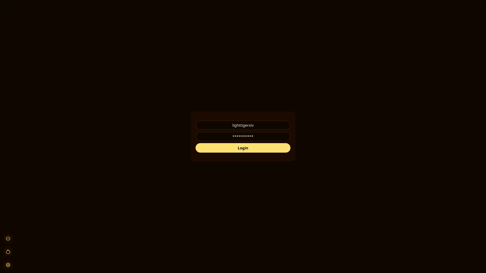

<div align="center">


### Whiskers for [SDDM](https://github.com/sddm/sddm)

<div>
    
    
</div>
</div>

## 👷‍♂️ Install

- Clone the repository

```
git clone https://github.com/Whiskers-Color-Scheme/sddm.git
cd sddm
```

- Run the install script

```
python install.py
```

### Install Options

| Command      | Abbreviation | Options                                             | Description                      |
| ------------ | ------------ | --------------------------------------------------- | -------------------------------- |
| --help       | -h           |                                                     | Shows the help                   |
| --theme      | -t           | [panther, tiger]                                    | Select the base theme to install |
| --accent     | -a           | [banana, blueberry, cherry, grape, kiwi, tangerine] | Select the accent color          |
| --background | -b           | (image path)                                        | Select a background image        |

Examples:

- `python install.py -t tiger `
- `python install.py -a grape`
- `python install.py -b ~/Pictures/Wallpapers/tiger.jpg`
- `python install.py -t tiger -a kiwi -b ~/Pictures/Wallpapers/tanjiro.png`

## 💻 Maintainers

- [lighttigerXIV](https://github.com/lighttigerxiv)
